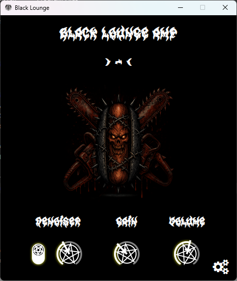
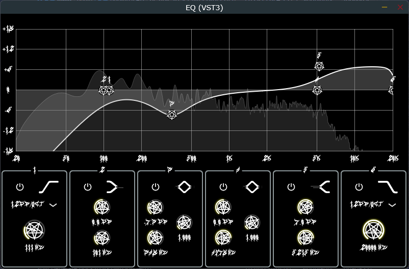
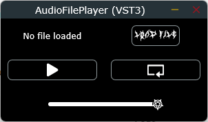

# Abyss Lounge 🤘

### A collection of the most evil and metal audio plugins ever created! 🤘
### Visit the [home page](https://erikgrahn13.github.io/audio/) for this project. 🍻

This is an onging project, and more plugins will be added in time!

---

### Black Lounge 🌭🪚


A guitar amplifier in honor of the legendary Black Lounge Studios owned by Jonas Kjellgren.
- Includes a tuner visible to the user all the time.
- A built-in denoiser with a knob to adjust the threshold that can be toggled on and off.
- A gain knob to be able to boost and attenuate the level that going in to the amplifier. 
- A volume knob to be able to adjust the overall output volume.

### EQ 🎛️📈

  

  A 7-band EQ that displays the fft of the processed signal of the plugin.

---

### AudioFilePlayer 🎶

  

  A plugin that can load an audio file to be played back. Contains a volume control and the possibility to loop the audio file. Only used for testing purposes when running VST3 effects in **AudioPluginHost**.

---

## Build

This plugins is built using the [Juce](https://juce.com) framework together with [React](https://react.dev/) for the ui using the webview technology supported in Juce.

It utilizes CMake presets but can also be built using plain CMake. The Debug preset is the preferred preset to work with during development. Juce together with other dependencies are fetched automatically during cmake configure step with the help of the [FetchContent](https://cmake.org/cmake/help/latest/module/FetchContent.html) module in CMake.

The React ui is built with Vite and needs to be installed before building any plugins with CMake can be done. Since Juce is fetched with FetchContent during the configuration step, CMake needs to be configured before React can be installed. During development you should run the dev server of the webview to be able to have hot reloading available.

#### Development
```bash
$ cmake --preset Debug
$ npm install
$ cd <plugin>/ui
$ npm run dev # needs to be invoked inside the plugin ui folder where the React application resides
$ cmake --build build  --target <plugin>
```

#### Release
```bash
$ cmake --preset Release
$ npm install
$ npm run build -ws # Invoked from the root of the project and will build all React projects
$ cmake --build build  --target <plugin>
```

> 💡 **Note:**
> Documentation is generated using Doxygen and uses the latest version of available official docker image from [Doxygen](https://github.com/doxygen/doxygen/releases). Therefore, to be able to build the docs target you need to have docker installed and have the daemon running.

---

The building of the plugins also builds the AudioPluginHost provided by JUCE so the plugins can be loaded in to a host. The mechanism for setting that up is already provided as debug configurations in launch.json.
