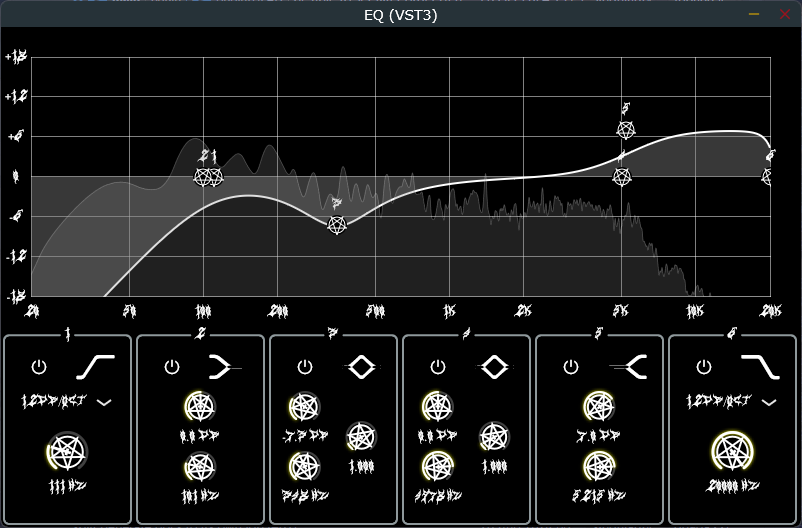
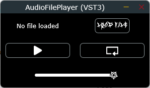

# 🎛️ FahlGrahn Audio

A collection of the most evil and metal audio plugins ever created!

Visit the [home page](https://erikgrahn13.github.io/audio/) for this project.

This is an onging project, and more plugins will be added in time!
The available plugins at the moment are:

- EQ

  

  A 7-band band EQ that displays the fft of the processed signal of the plugin.

---

- Synth

---

- AudioFilePlayer

  

  A plugin that can load an audio file to be played back. Contains a volume control and the possibility to loop the audio file.

---

## Build

This project utilizes CMake presets but can also be built using plain old CMake. The Debug preset is the preferred preset to work with during development. The plugins are built using the [JUCE](https://github.com/juce-framework/JUCE) framework that is fetched during cmake configure step with the help of the [FetchContent](https://cmake.org/cmake/help/latest/module/FetchContent.html) module in CMake.

```bash
git clone https://github.com/erikgrahn13/audio.git
cd audio
cmake --preset Debug
cmake --build build <plugin>
```

If using VSCode it is recommended to use the [CMake Tools](https://marketplace.visualstudio.com/items?itemName=ms-vscode.cmake-tools) extension for managing the development.

The building of the plugins also builds the AudioPluginHost provided by JUCE so the plugins can be loaded in to a host. The mechanism for setting that up is already provided as debug configurations in launch.json.
